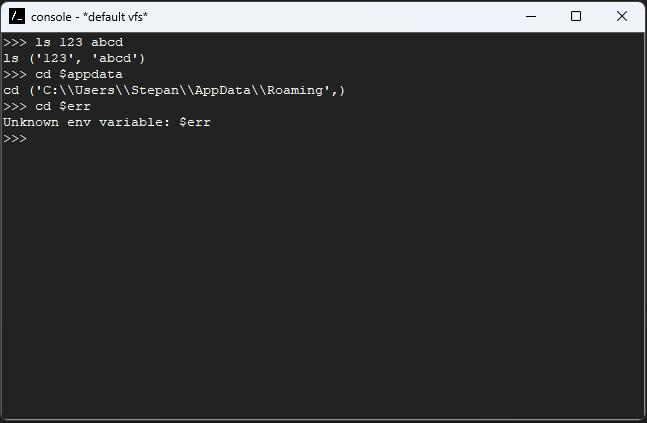
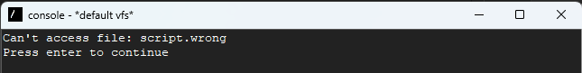

# Конфигурационное управление/Практика 1
## Низамутдинов Степан ИКБО-20-24
Вариант 16

## Запуск
Запуск в режиме графического интерфейса:
```
pythonw console-gui.py
```
Запуск в режиме CLI:
```
python console.py
```

## Этап 2
### Список изменений:
1. Добавлена поддержка аргументов командной строки
2. Добавлен аргумент ```--script | -s``` (выполняет команды из указанного файла)
3. Добавлен аргумент ```--vfs-path | -v``` (указывает путь к виртуальной файловой системе)

### Демонстрация работы:

```
pyw console-gui.py --script script.txt
```


```
pyw console-gui.py --script script.wrong
```



```
pyw console-gui.py --vfs-path test-vfx.xml
```


## Этап 1
### Список изменений:
1. Добавлены команды-заглушки ```ls, cd``` (выводят список переданных аргументов)
2. Добавлена команда ```exit``` (закрывает приложение)
3. Реализована передача аргументов с раскрытием переменных окружения

### Демонстрация работы:


