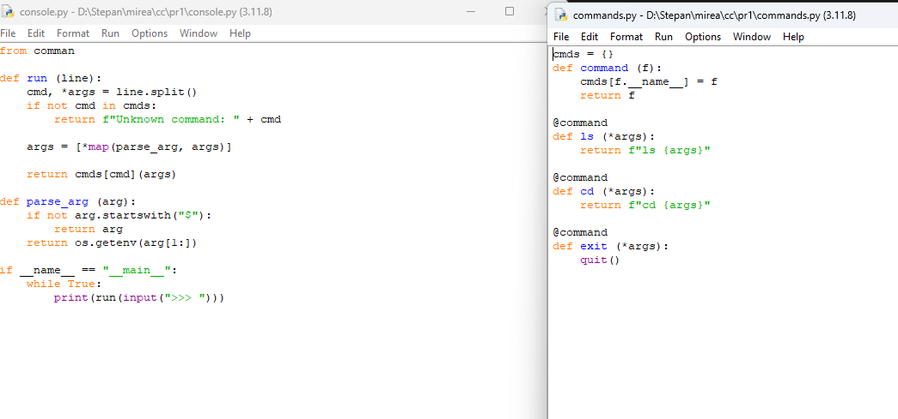

# Конфигурационное управление/Практика 1
## Низамутдинов Степан ИКБО-20-24
Вариант 16

## Этап 1
Нововведения:
1. Добавлен графический интерфейс
2. Добавлены команды-заглушки ```ls, cd```
3. Добавлена команда выхода ```exit```


