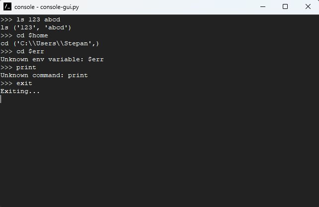

# Конфигурационное управление/Практика 1
## Низамутдинов Степан ИКБО-20-24
Вариант 16

## Запуск
Запуск в режиме графического интерфейса:
```
pythonw console-gui.py
```
Запуск в режиме CLI:
```
python console.py
```

## Этап 1
Список изменений:
1. Добавлены команды-заглушки ```ls, cd``` (выводят список переданных аргументов)
2. Добавлена команда ```exit``` (закрывает приложение)
3. Реализована передача аргументов с раскрытием переменных окружения

Демонстрация работы:
###### 
